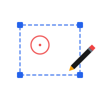
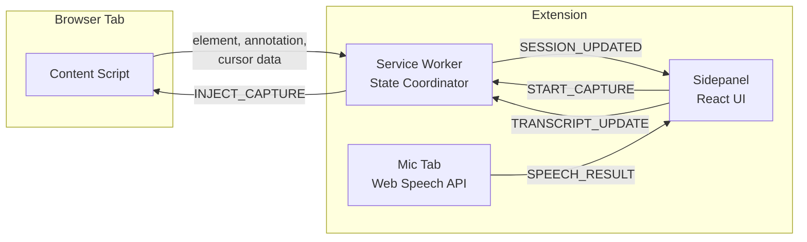

<div align="center">

    
# PointDev

**Structured browser context capture for AI coding tools**

Talk, draw, and click in your browser. PointDev captures the technical context and your intent, then compiles it into a structured prompt any AI agent can act on.

[](https://typescriptlang.org)
[](https://react.dev)
[](https://developer.chrome.com/docs/extensions/mv3/)
[](https://bun.sh)
[](LICENSE)
[](CONTRIBUTING.md)
[](https://github.com/BraedenBDev/pointdev/issues)

[Getting Started](#quickstart) · [How It Works](#how-it-works) · [Features](#features) · [Roadmap](#roadmap) · [Contributing](CONTRIBUTING.md)

</div>

---

## What is PointDev?

You spot a problem in your browser. You switch to Claude Code and type "the hero font is too small." The agent has to guess which file, which component, what the current size is, and what "too small" means. The DOM path, component name, computed styles, and your spatial intent are all lost.

Browser automation gives AI agents eyes. PointDev gives humans a voice.

PointDev captures technical context (element selector, DOM subtree, computed styles, React component name, device metadata) and human context (timestamped voice narration, canvas annotations, cursor dwell behavior) simultaneously, then compiles everything into structured output any downstream tool can consume.

**Key highlights:**

- **Talk, draw, click** all at the same time during a single capture session
- **Temporal correlation** links what you're pointing at with what you're saying
- **Works on any web page**, with opportunistic React component detection
- **Copy and paste** the structured output into any AI coding tool

### Real Output

This is actual output from PointDev, captured on a live site:

```
## Context
- URL: https://almostalab.io/
- Page title: Almost A Lab — Building the Future of AdTech
- Viewport: 1677 x 1145px
- Captured at: 2026-03-15 15:12:20

## User Intent (voice transcript)
[00:04] "I think the"
[00:06] "main hero"
[00:09] "is far too"
[00:11] "large"
[00:15] "and we need to adjust the line breaking"
[00:19] "two or three lines at Max"
[00:23] "and there is a problem at the bottom here"
[00:26] "where you scroll CTA"
[00:32] "overlapping with the"
[00:35] "subtitle of the page"

## Annotations
1. [00:40] Circle around .lg\:min-h-\[100svh\] at (42, 1019), radius 131px

## Cursor Behavior
- [00:07-00:32] Dwelled 25.5s over h1.font-display.text-hero (during: "main hero")
- [00:25-00:32] Dwelled 7.3s over div.absolute.bottom-10 (during: "scroll CTA")
- [00:29-00:36] Dwelled 6.2s over div.absolute.bottom-10 (during: "overlapping with the")
```

### What an AI Agent Does With This

We pasted PointDev output into a Claude Code session managing the live website. Without any prior context, the agent:

1. **Identified three UI issues** from the voice transcript, annotations, and cursor dwell data
2. **Mapped each issue to specific elements** (the `h1.font-display`, `div.absolute.bottom-10` overlap, padding mismatch)
3. **Offered to fix all three immediately**, asking only "Want me to look at the Hero component and fix these alignment/spacing issues?"

The agent also described what would make the output even more actionable:

> "The ideal output for an agent is: screenshot + voice intent + source file:line + computed styles on each annotation target. That's a one-shot fix with no exploration needed."

> "Loom for humans, annotated screenshots + structured metadata for agents. Same capture session, two output formats."

That feedback is now driving our [roadmap](#roadmap).

---

## Quickstart

> **Status: Proof of Concept.** Working demo, not a production release.
>
> Requires [Bun](https://bun.sh) and Chrome.

```bash
git clone https://github.com/BraedenBDev/pointdev.git
cd pointdev
bun install
bun build
```

1. Open `chrome://extensions/`, enable **Developer Mode**
2. Click **Load unpacked** and select the `dist/` folder
3. Open any web page, click the PointDev icon to open the sidepanel
4. On first open, a tab will ask for microphone permission (one-time setup)

---

## How It Works



**Sidepanel (React):** Capture controls, live feedback, compiled output display, copy-to-clipboard.

**Service Worker:** Coordinates state between sidepanel and content script. Holds the `CaptureSession`, routes messages, captures element screenshots.

**Content Script:** Injected into the active page. Handles element selection, canvas annotation overlay (position: fixed, redraws on scroll), cursor tracking, and React component detection.

**Mic-Permission Tab:** Runs Web Speech API in a visible extension page. Chrome sidepanels and offscreen documents cannot get microphone access, so speech recognition runs here and sends results back via messaging.

All capture data flows into a single `CaptureSession` object with timestamps relative to recording start. A template formatter compiles this into the structured output.

---

## Features

**Technical context (captured automatically):**

| Feature | Description |
|---------|-------------|
| CSS selector + DOM subtree | Click any element to capture its selector and surrounding HTML |
| Computed styles | font-size, color, spacing, display, position, and more |
| React component detection | Resolves component name via `__reactFiber$` internals |
| Page metadata | URL, title, viewport dimensions |
| Device metadata | Browser, OS, screen size, pixel ratio, touch, color scheme |
| Cursor dwell tracking | Records which elements you hover over and for how long |
| Element screenshot | Captured via `captureVisibleTab` on element selection |

**Human context (your input):**

| Feature | Description |
|---------|-------------|
| Voice narration | Speak naturally; transcription runs live with timestamps |
| Visual annotations | Draw circles and arrows directly on the page |
| Element selection | Click the specific element you mean |

**Everything is temporally correlated.** The cursor dwell data shows which element you were pointing at when you said each phrase. Annotations are timestamped to align with your voice.

---

## Tech Stack

| Layer | Technology |
|-------|-----------|
| Extension | Chrome Manifest V3 |
| UI | React 18, TypeScript |
| Build | Vite + CRXJS |
| Runtime | Bun |
| Canvas | HTML5 Canvas API (annotation overlay) |
| Voice | Web Speech API |
| Testing | Vitest (84 tests) |

---

## Project Structure

```
pointdev/
├── src/
│   ├── background/         # Service worker, message handler, session store
│   ├── content/            # Element selector, canvas overlay, cursor tracker,
│   │                       # React inspector, device metadata
│   ├── shared/             # Types, message definitions, template formatter,
│   │                       # dwell computation
│   └── sidepanel/          # React UI: App, hooks, components
├── public/                 # Offscreen doc, mic-permission page, icons
├── tests/                  # Vitest unit tests (mirrors src/ structure)
├── docs/
│   ├── design/             # MVP spec, implementation plan, library research
│   └── genai-disclosure/   # AI-assisted development log
├── CLAUDE.md               # AI agent guidance for this codebase
├── CONTRIBUTING.md         # Dev setup, testing, commit conventions
└── README.md
```

---

## Permissions

PointDev requests minimal Chrome permissions:

| Permission | Why |
|---|---|
| `activeTab` | Access the current tab when you start a capture |
| `scripting` | Inject the content script for element selection and annotation |
| `sidePanel` | The extension UI |
| `storage` | Persist capture session and mic permission state |
| `offscreen` | Reserved for future local transcription support |

No background access to your browsing. No data leaves your machine except Web Speech API audio, which Chrome sends to Google for transcription.

---

## Roadmap

- [x] Element selection with CSS selector, computed styles, DOM subtree
- [x] React component detection via fiber internals
- [x] Canvas annotation overlay (circle, arrow) with scroll anchoring
- [x] Voice transcription with timestamped segments
- [x] Cursor dwell tracking with temporal correlation
- [x] Device metadata capture
- [x] Element-scoped screenshots
- [x] Compiled structured output with copy-to-clipboard
- [ ] Screenshot at each annotation timestamp ([#19](https://github.com/BraedenBDev/pointdev/issues/19))
- [ ] Source file path resolution from selectors ([#20](https://github.com/BraedenBDev/pointdev/issues/20))
- [ ] Computed styles + DOM subtree on annotations ([#21](https://github.com/BraedenBDev/pointdev/issues/21))
- [ ] Box model extraction ([#24](https://github.com/BraedenBDev/pointdev/issues/24))
- [ ] Accessibility capture (ARIA roles, names) ([#23](https://github.com/BraedenBDev/pointdev/issues/23))
- [ ] Multi-element selection ([#13](https://github.com/BraedenBDev/pointdev/issues/13))
- [ ] Freehand, rectangle, text annotation tools ([#8](https://github.com/BraedenBDev/pointdev/issues/8))
- [ ] Local speech-to-text via Whisper ([#7](https://github.com/BraedenBDev/pointdev/issues/7))
- [ ] Pluggable output formats: JSON, Markdown, MCP ([#10](https://github.com/BraedenBDev/pointdev/issues/10))
- [ ] Vue and Svelte component detection ([#9](https://github.com/BraedenBDev/pointdev/issues/9))
- [ ] Console and network error capture ([#11](https://github.com/BraedenBDev/pointdev/issues/11))
- [ ] Direct delivery to AI tools via bridge server ([#12](https://github.com/BraedenBDev/pointdev/issues/12))

See all [open issues](https://github.com/BraedenBDev/pointdev/issues) for the full backlog.

---

## Contributing

Contributions are welcome! See [CONTRIBUTING.md](CONTRIBUTING.md) for development setup, testing, coding standards, and commit conventions.

Look for issues labeled [**good first issue**](https://github.com/BraedenBDev/pointdev/issues?q=is%3Aissue+is%3Aopen+label%3A%22good+first+issue%22) and [**help wanted**](https://github.com/BraedenBDev/pointdev/issues?q=is%3Aissue+is%3Aopen+label%3A%22help+wanted%22).

---

## AI-Assisted Development Disclosure

This project is built using AI coding tools (Claude Code, Cursor) as the primary implementation workflow. The developer architects solutions, defines acceptance criteria, and reviews all code. AI agents execute implementation tasks under human direction.

Commits from AI agents use `Co-Authored-By` tags so they are distinguishable from human-authored commits. All code is reviewed, tested, and validated by the maintainer before merging. Architectural decisions are made by the human lead.

This is directly relevant to PointDev's mission: we're building a tool that improves the input side of human-to-AI-coder communication, and we're building it with those same tools.

Full development log: [`docs/genai-disclosure/development-log.md`](docs/genai-disclosure/development-log.md)

---

## License

MIT. See [LICENSE](LICENSE).

---

<div align="center">

**[github.com/BraedenBDev/pointdev](https://github.com/BraedenBDev/pointdev)** · Built by [Braeden Bihag](https://almostalab.io) at [Almost a Lab](https://almostalab.io)

</div>
